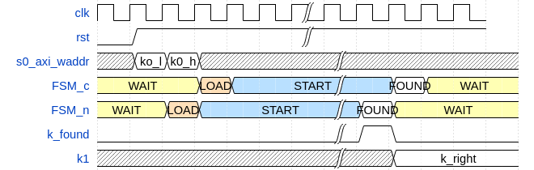

# Project report: DES CRACKER

The report and all source files can be found in the `Alberto.Anselmo` and `Giulio.Roggero` branches.

## Team members:

* ANSELMO, Alberto: [Alberto.Anselmo@eurecom.fr](mailto:Alberto.Anselmo@eurecom.fr)

* ROGGERO, Giulio: [Giulio.Roggero@eurecom.fr](mailto:Giulio.Roggero@eurecom.fr)

The following report regards a DES bruteforce cracker that has been designed during the __Digital Systems, Hardware - Software Integration__ (AY 2018-19).

# DES Cracker
The goal of this project is to design using `VHDL` a cracker to disclose the key used in the DES enciphering. Knowing the plaintext and the ciphertext, and given a key as a starting point, the HW we have designed will try several possible keys, finally founding the right one, which will be saved in a particular register.
All the design in interfaced using the `AXI Lite 4` protocol to the `ARM` core that is present on the board, so that the registers used to communicate between our design and the external world can be accessed using a simple serial connection which allows to give instructions to the CPU.

## Working Flow
For this project, we have decided to work in such a way:
* design of new unit/layer
* test of the above unit
This has given the opportunity to concentrate the simulation and the testing only on the examined layer, as this phase was already done for the ones standing at lower levels, as we can assume, with a certain degree of safety, that they behave as desired.
Some simulations have been done launching __ModelSim__ commands using a **Python** script, while others designing a "regular" testbench.
At the end, using the [synthesis script](./des_cracker.syn.tcl), a synthesis has been run. On the top of this circuit, which uses the programmable part of the FPGA, a simple driver written in `C` has been developed, to conclude the project.

## Description
In this section we will go through all the files that belong to the project, giving a brief explanation:
* Design source files:
 * [`0_des_pkg.vhd`](./0_des_pkg.vhd): a package which contains constant declarations, functions and types that will be used in the design, as well as components to instantiate

 * [`1_ff.vhd`](./1_ff.vhd): a simple FF with arbitrary size, with synchronous and asynchronous reset in two different architecture, ready to be used in the upper layers

 * [`2_p_box.vhd`](./2_p_box.vhd): an entity that permutes the input accordingly to a constant table previously defined

 * [`3_s_box.vhd`](./3_s_box.vhd): this entity perform the substitution, as defined in the DES standard

 * [`4_k_gen.vhd`](./4_k_gen.vhd): generates the new key for the round, as specified by the standard

 * [`5_f.vhd`](./5_f.vhd): it executes a full round of the DES

 * [`6_des.vhd`](./6_des.vhd): this entity wraps the different stages of the DES enciphering, providing also a division into several stages of a pipeline

 * [`8_des_mux.vhd`](./8_des_mux.vhd): this entity provides an interface to instantiate and handle multiple DES cracker entity in parallel, by distributing the keys to test and finally checking if a correct key has been found to send to the upper layer

 * [`des_cracker.vhd`](./des_cracker.vhd): this is the top level entity, which wraps around and includes the control unit, as well as the `AXI` protocol to communicate with the memory

 * [`rnd_pkg.vhd`](./rnd_pkg.vhd): a package containing some functions and procedures to create random numbers

* Simulation files:

 * [`7_des_tb.vhd`](./7_des_tb.vhd): stimulus for a simple DES simulation, to check the outputs at different stages and prepare a more complex testbench

 * [`9_des_mux_tb.vhd`](./9_des_mux_tb.vhd): simple simulation to check the reference behavior of multiple DES at once

 * [`des_cracker_tb.vhd`](./des_cracker_tb.vhd): a regular simulation for the wrapper, to check the correctness of the `AXI` protocol and its implementation for the wrapper

 * [`des_cracker_tb.py`](./des_cracker_tb.py): complete simulation of the wrapper, which takes as argument the number of tests to perform and the number of DES cracker to instantiate

 * [`des_mux.py`](./des_mux.py): a Python simulation to perform a series of test on several DES at the same time

 * [`des.py`](./des.py): a software implementation of the DES, to correctly encipher and check the results

 * [`modelsim.py`](./modelsim.py): declaration of classes and methods used to interface __ModelSim__ with Python, using a series of FIFO to communicate

 * [`sim.py`](./sim.py): a simulation of all the rounds of the DES, single entity

* Other files:

 * [`des_cracker.syn.tcl`](./des_cracker.syn.tcl): synthesis script, with some modifications to explore more aggressively the timing optimizations

 * [`des_driver.c`](./des_driver.c): simple driver to write and read from the mapped registers used in the HW implementation of the cracker

 * [`des_cracker.timing.rpt`](./des_cracker.timing.rpt): synthesis timing report

 * [`des_cracker.utilization.rpt`](./des_cracker.utilization.rpt): synthesis area report

## Design:
We started from the specifications of the `DES standard` to design the units that were in charge of enciphering. Then we proceed going on with the datapath, finally making the FSM for the control unit and wrapping everything around with the `AXI` protocol.

The __datapath__ is basically what is included in the [`8_des_mux.vhd`](./8_des_mux.vhd), i.e. the several instances of the cracker operating in parallel plus a final comparator that looks for a possible match through inspecting the ciphertexts.


As can be seen from the picture, several units in parallel work on the same inputs, while their outputs is finally processed. This give us a very high flexibility, as the number `N_DES` of instances present is completely generic.

The __control unit__, on the other hand, does not have a reserved file, but is implemented directly using several processes in the [`des_cracker.vhd`](./des_cracker.vhd). There are three different states for the FSM, that can be seen in the following waveform.



Three states are present:

* __WAIT__, used to wait for the correct start, given when the higher part of `k0` is written. In this case a transition to the __LOAD__ state is performed, to prepare the attack.

* __START__, in this state the attack is fully running. If, by any chance, a write access to the `k0` register happens, the acquisition is stopped and the FSM goes back to __WAIT__ state

* __FOUND__, final state in which the `irq` gets risen up, which that leads again to the __WAIT__ state

### Goal:
In our design space, we have to minimize the following ratio:

$T_{clk}/N_{cracker}$

As a matter of fact, we know that every clock cycle we will have `N_cracker` possible ciphers to test, therefore having tried `N_cracker` possible keys. By minimizing that ratio, we will get the best possible compromise between the number of crackers that are working in parallel and the highest possible frequency.


### Pipelining
At the beginning, we decided to pipeline every stage of the pipe, including the first permutation and the last one. This has been done to sensibly improve the performances.
As a matter of fact, we do not really care about the __latency__ of our bruteforce attack. Waiting for a couple of tenths of clock cycles is not at all a problem, as we do not have any real time schedule to respect. On the other hand, working on a pipeline allows us to get a better critical path, thus leading to a smaller clock period and higher clock frequency, which leads to an overall better performances with respect to time.

### Drawbacks
On the other hand, we are probably increasing the power, as more register are involved to pipeline a more important switching activity will be obtained. This will of course cause more switching power, which is the most relevant contribution.
For the very same reason, an increase of the area will be observed as well, as we will need more intermediate registers to save the results of the different stages and pipeline them.

### Considerations
At the end of the day, we can however consider that the above mentioned defects are not so crucial in the context of our implementation, so we will go on the pipeline idea, keeping in mind what we have mentioned in case we need to improve in some "directions" of our design space.

### Additional stage
After many trials, we have observed that the critical path consisted in the comparison of all the obtained ciphers with the correct one. Therefore, we have split the comparison into two subparts, each one of 32 bits. Then, the results of this stage is output for the next one, therefore we check that both the high and low parts are equal in the following clock cycle and eventually we write the correct key and raise the signal to communicate that the result has been found. The algorithm is the following:
```
@CC=i
for i in range(DES_N-1):
    comp_high(i)    = True if (cipher_high(i)   == cipher_target)
    comp_low(i)     = True if (cipher_low(i)    == cipher_target)

@CC=i+1
for i in range(DES_N-1):
    if (comp_high(i) == 1) and (comp_low(i)==1):
        key_found = 1
        key_right = key(i)
    else:
        key_found = 0
```
This of course requires some more registers, but it has allowed us to sensibly increase the clock frequency by improving on the critical path.

### Other possible improvements
It is worth mentioning that we could have also decided to apply the inverse of the final permutation to the target ciphertext. We could have then compared the part related to `L16`, i.e. the right one which is already stored in a register in the same clock cycle where the `R16` is computed. Then, we could have matched this part with the corresponding of the permuted cipher. This could have allowed us to spare some registers and eventually give us the chance to add one cracker, but this idea came eventually too late to implement (and test) it.

## Testing
For the testing, we have decided to experiment a bit and follow a particular approach.

On a first approximation of this phase, for the layer, we have performed some testing using `ModelSim` in a conventional way, i.e. writing a testbench using a regular `VHDL` file, applying inputs and checking for the outputs.

Once that the validity of the control signals has been checked, we have intensively test using some `Python` scripts, which allow us to handle in an easier way the signals and the possible pattern that we can receive in output. It is relevant to note that `ModelSim` has to be included in the `PATH`, since commands are needed to be used.

After several trials, we think we have obtained a design which successfully works in the "normal" operating conditions. Of course, we have tried to test for several corner cases, in order to observe possible misbehavior. We had in some occasions to correct our design to fully respect the protocol.

However, it is known that testing can not be performed for all the possible input data pattern. Nevertheless, it is however possible that some conditions are not handled correctly.

## Synthesis
We have run a synthesis script which instantiates 10 different design crackers at once. This implies that at the same time we are testing 10 different keys, therefore improving a lot with respect to a single one.
In order to get better timing performance, which is the design variable we have been focused on, we run the following `TCL` commands:
```
opt_design -directive Explore
place_design -directive ExtraTimingOpt
phys_opt_design -directive Explore
route_design -directive Explore
```
With respect to the scripts used before during lectures, those options allows the synthesizer to run some more trials to better optimize the obtained result. Since the algorithms used are of course not of the "exact" type, but "heuristic" ones, it is more likely that better results are obtained, giving more possibilities to the software in charge of the physical floorplanning.

As mentioned in the [description](#description), the two generated reports are included. We can focus on some parts we consider to be relevant:

* as in can be seen in the [timing report](./des_cracker.timing.rpt), a clock having a frequency of `200 MHz` will still meet the timing constraint. Additionally, the critical path for the setup regards some control units signal, so we decided to stop with the improvements also on the signals which might violate the hold time, since it is very unlikely that there is sufficient margin to increase more the frequency. From further investigations, it is possible to notice that the `AXI` controller is involved in the critical path, which gives us poor space to provide efficient optimizations. We were therefore satisfied with the achieved results.

```
Clock       Waveform(ns)         Period(ns)      Frequency(MHz)
-----       ------------         ----------      --------------
clk_fpga_0  {0.000 2.500}        5.000           200.000                

From Clock:  clk_fpga_0
  To Clock:  clk_fpga_0

Setup :            0  Failing Endpoints,  Worst Slack        0.102ns,  Total Violation        0.000ns
Hold  :            0  Failing Endpoints,  Worst Slack        0.015ns,  Total Violation        0.000ns
PW    :            0  Failing Endpoints,  Worst Slack        1.520ns,  Total Violation        0.000ns
---------------------------------------------------------------------------------------------------
```

* the total slice that are used are reported in the [utilization report](./des_cracker.utilization.rpt). As one may see, there is probably some more space to instantiate an additional cracker, leading to 11 in total, but this will probably bring to a too high occupation of the floorplan. This might cause problems especially to clock distribution, so we decided to keep the number of `DES` instances to 10, in order to have some margin for the synthesizer to work. In addition, it is possible to see how no latches are (wrongly) present in our design. On the other hand, even if our design uses some muxltiplexers, their sizes are not enough to justify the usage of the onboard muxes. Therefore, their functions are mapped to the regular LUTs.

```
+----------------------------+-------+-------+-----------+-------+
|          Site Type         |  Used | Fixed | Available | Util% |
+----------------------------+-------+-------+-----------+-------+
| Slice LUTs                 | 15653 |     0 |     17600 | 88.94 |
|   LUT as Logic             | 15601 |     0 |     17600 | 88.64 |
|   LUT as Memory            |    52 |     0 |      6000 |  0.87 |
|     LUT as Distributed RAM |     0 |     0 |           |       |
|     LUT as Shift Register  |    52 |     0 |           |       |
| Slice Registers            | 20809 |     0 |     35200 | 59.12 |
|   Register as Flip Flop    | 20809 |     0 |     35200 | 59.12 |
|   Register as Latch        |     0 |     0 |     35200 |  0.00 |
| F7 Muxes                   |     0 |     0 |      8800 |  0.00 |
| F8 Muxes                   |     0 |     0 |      4400 |  0.00 |
+----------------------------+-------+-------+-----------+-------+
```

## Driver
A relatively simple [driver](./des_driver.c) has been developed. It has an extremely simple role. The kernel modules that are already present map to a specific region of the virtual memory the `AXI` registers of our design.

As a consequence, a sort of a file pointer is memory mapped. Then, we enable the interrupts by writing on the above mentioned file pointer.

The user is required to enter the values needed, or alternatively the char `q` to quit.
```c
printf("Please enter the plaintext:\n");
scanf("%s", p_all);
if(strncmp(p_all, "q", 1) == 0){
	break;
}
printf("Please enter the cyphertext:\n");
scanf("%s", c_all);
if(strncmp(c_all, "q", 1) == 0){
	break;
}
printf("Please enter the starting key:\n");
scanf("%s", k0_all);
if(strncmp(k0_all, "q", 1) == 0){
	break;
}
// Enable interrupts
interrupts = 1;
// Enable interrupts
if(strncmp(p_all, "0x", 2) == 0){
	strncpy(p_h, &p_all[2], 8);
	strncpy(p_l, &p_all[10], 8);
	p_h[BASE32_SIZE] = '\0';
	p_l[BASE32_SIZE] = '\0';
} else {
	strncpy(p_h, &p_all[0], 8);
	strncpy(p_l, &p_all[8], 8);
	p_h[BASE32_SIZE] = '\0';
	p_l[BASE32_SIZE] = '\0';
}
if(strncmp(c_all, "0x", 2) == 0){
	strncpy(c_h, &c_all[2], 8);
	strncpy(c_l, &c_all[10], 8);
	c_h[BASE32_SIZE] = '\0';
	c_l[BASE32_SIZE] = '\0';
} else {
	strncpy(c_h, &c_all[0], 8);
	strncpy(c_l, &c_all[8], 8);
	c_h[BASE32_SIZE] = '\0';
	c_l[BASE32_SIZE] = '\0';
}
if(strncmp(k0_all, "0x", 2) == 0){
	strncpy(k0_h, &k0_all[2], 6);
	strncpy(k0_l, &k0_all[8], 8);
	k0_h[BASE56_SIZE/2] = '\0';
	k0_l[BASE32_SIZE] = '\0';
} else {
	strncpy(k0_h, &k0_all[0], 6);
	strncpy(k0_l, &k0_all[6], 8);
	k0_h[BASE56_SIZE/2] = '\0';
	k0_l[BASE32_SIZE] = '\0';
}
```
After that, we enable our interrupt:
```c
interrupts = 1;
// Enable interrupts
if(write(fd, &interrupts, sizeof(interrupts)) < 0) {
  fprintf(stderr, "Cannot enable interrupts: %s\n", strerror(errno));
  status = -1;
  break;
}
```
The acquisition will not however start, as it waits for the writing on the higher part of the `k0` register to begin with:
```c
regs[0] = strtoul(p_l, NULL, 16);
regs[1] = strtoul(p_h, NULL, 16);

fflush(stdout);
// printf("Plain written %x%x\n", regs[1], regs[0]);
// fflush(stdout);

// Cyphertext
regs[2] = strtoul(c_l, NULL, 16);
regs[3] = strtoul(c_h, NULL, 16);
// printf("Cypher written %x%x\n", regs[3], regs[2]);
// fflush(stdout);

// Starting secret key
regs[4] = strtoul(k0_l, NULL, 16);
regs[5] = strtoul(k0_h, NULL, 16);
// printf("k0  written %x%x\n", regs[5], regs[4]);
```
Then at this point we call a blocking read which will wait for an interrupt to happen. In our case, this will occur on the rising edge of the `irq` signal.
```c
// Wait for interrupt
 if(read(fd, &interrupts, sizeof(interrupts)) < 0) {
   fprintf(stderr, "Cannot read device file: %s\n", strerror(errno));
   status = -1;
   break;
 }
```
Finally, the driver prints the obtained values:
```c
// Read and display content of interface registers
printf("\nFound key: 0x%x%x\n\n", regs[9], regs[8]);
```
